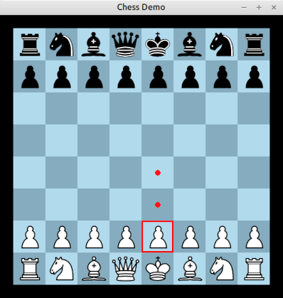

# The "Babylon" programming language

**Babylon** is a new programming language with support for formal
verification. It is an imperative, low-level language, with C-like
syntax and semantics, and without garbage collection, but with support
for `requires`, `ensures` and other verification features (checked by
SMT solvers).

Compared to other similar languages (such as SPARK, Verus, Dafny, and
others), Babylon's main design goal is to keep the language as small
and simple as possible. Advanced features, such as typeclasses/traits,
object orientation, or exceptions, are deliberately omitted. The idea
is that it should be possible to write down a formal semantics for the
language in only a few pages, and it should be feasible for one person
to write a formally verified compiler based on that semantics (using
AI assistance to help write the proofs). The author is currently
working on such a compiler, written in Isabelle.

# Current Status

 - An initial prototype implementation, written in C, has been
   completed. Preliminary [documentation](docs) is also available.

    - This is enough to act as a proof of concept for the language,
      although it is not ready for production use yet. For example:
       - some important features (such as recursion) are not yet
         implemented;
       - bugs may be present;
       - the author reserves the right to change the language definition
         in non-backwards-compatible ways.

      Users are therefore advised to wait until v1.0 before doing any
      serious work with the language.

 - The planned next step is to write a formally verified
   implementation in Isabelle. This will include:
    - a formalization of the static and dynamic semantics of the language;
    - a type soundness theorem;
    - a code generator (along with a proof that the compiled
      code has the same semantics as the original program);
    - a verifier (along with a proof that if all generated verification
      conditions are met, then the program is sound, in some precise
      sense).

   Work on this is currently underway, and will be completed perhaps
   some time in 2028--9.

# Examples

Here is a simple example of a Babylon program:

    module Prime

    interface {
        // Define what is meant by a prime number.
        ghost function is_prime(n: i32): bool
        {
            return n >= 2 &&
                forall (i: i32) 2 <= i < n ==> n % i != 0;
        }

        // Declare an executable function which will check whether a
        // given number is prime.
        // Note the "ensures" condition which means that the compiler
        // will verify that the function meets its specification, i.e.,
        // it returns true if and only if `is_prime(n)` is true.
        function check_if_prime(n: i32): bool
            ensures return <==> is_prime(n);
    }

    // This is the implementation of "check_is_prime".
    // (This is not the fastest way to detect prime numbers by
    // any means, but it is simple and easy to verify.)
    function check_if_prime(n: i32): bool
        ensures return <==> is_prime(n);
    {
        if n < 2 {
            return false;
        }

        var i: i32 = 2;
        while i < n
            invariant 2 <= i <= n;
            invariant forall (j: i32) 2 <= j < i ==> n % j != 0;
            decreases ~i;
        {
            if n % i == 0 {
                return false;
            }
            i = i + 1;
        }

        return true;
    }

Further examples can be found in the [packages](packages) folder of
this repository. Some highlights:

 - [Example07.b](packages/example07-primes/src/Example07.b) is a more
   efficient prime number calculator using the Sieve of Eratosthenes.

 - [Example14.b](packages/example14-gcd/src/Example14.b) implements
   Euclid's algorithm for finding the greatest common divisor of two
   numbers.

 - [chess](packages/chess) implements a simple interactive chess game.
   This uses [SDL](https://www.libsdl.org/) to do the graphics and
   mouse input.

*A screenshot of the chess demo. The Babylon compiler verifies that
this program cannot crash at runtime (or at least, the parts written
in Babylon cannot crash -- the program does also include C code which
is unverified). We do not verify functional correctness, i.e. that the
rules of chess are correctly implemented -- but perhaps that could be
a future project!*

# Building/Installing

This section describes how to build the current C implementation of
the Babylon compiler.

A Linux machine, with the `gcc` and `make` commands and the
`libsqlite3` library, is required.

To build the compiler you can simply run "make". An executable file
`build/bab` will appear.

If you want to use the verifier, you will need to make sure that at
least one (and preferably at least 2--3) of the commands `z3`, `cvc5`,
`vampire` or `alt-ergo` are available on your system. (I personally
use the first three from that list.) You might be able to get
pre-built binaries at the following links:
[z3](https://github.com/Z3Prover/z3/releases),
[cvc5](https://cvc5.github.io/downloads.html),
[vampire](https://github.com/vprover/vampire/releases),
[alt-ergo](https://alt-ergo.ocamlpro.com/). Otherwise they can be
built from source. Put the binaries into your search path somewhere.

The first time the `bab` command is run, it will scan the `PATH` to
see which SMT solvers are installed, and create an appropriate config
file in `$HOME/.config/babylon/babylon.toml`. Therefore, install any
required SMT solvers before running `bab` for the first time. You can
also edit the config file manually, and/or run `bab check-config` to
verify that the config is correct.

You can also run `make check` to run a suite of compiler self-tests.

For instructions on how to use the compiler, check the [docs](docs)
folder, and/or look at the `example` directories under
[packages](packages) (reading these in numerical order will provide a
tutorial of sorts).

# Further Info

There is a [project website](https://www.solarflare.org.uk/babylon)
containing some additional info about the project.

# Disclaimer

For the avoidance of doubt: this project is currently considered an
experimental prototype, not a fully working system, and is provided
WITHOUT WARRANTY OF ANY KIND.

# Contact

I can be contacted by email at: stephen (at) solarflare.org.uk.
