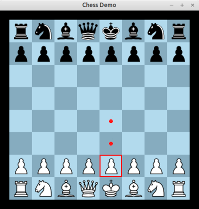

# Chess demo

This folder contains an interactive chess game written in a mix of
Babylon and C.

The "game" is just a simple 2 player chess game. There is no computer
opponent, but you can make moves on the chess board. Only legal chess
moves will be permitted. The game implements nearly all the rules of
chess -- the only caveat is that when a pawn is promoted, you must
promote to a Queen (this is mostly because I couldn't be bothered to
make the UI for selecting which piece to promote to!).

All source code is in the "src/" folder. The main bulk of the code,
implementing the game and UI logic, is written in Babylon. The
remainder is written in C and handles the graphics, mouse input,
memory allocation, and certain other functions that cannot be done
purely in Babylon at the moment. The C code itself uses SDL 2 for
doing the graphics and mouse input.

# Screenshot

# How to build this

I recommend creating a "build" directory to hold the temporary files
from the build. Also create "build/cache" to hold cache files from the
verifier.

    mkdir -p build/cache

Then run

    babylon -V src/ChessMain -o build

to verify the code. (This step can be skipped if you don't want to
bother verifying, or e.g. if you don't have the SMT solvers
installed.)

To build the executable itself, first make sure you have SDL2
installed (e.g. on Debian-like systems, make sure the "libsdl2-dev"
package is installed).

Now run

    babylon -c src/ChessMain -o build
    gcc build/*.s src/*.c -o chess `pkg-config sdl2 --cflags --libs` -lm

to build the "chess" executable. Then you can type `./chess` to run
the game.

# Credits

The example uses some freely available images of chess pieces designed
by Colin M.L. Burnett (see "images" directory). See the README file in
that directory for more info.

I also make use of the "stb_image.h" C library (included in the "src"
folder) to load the images into the program. Licence conditions are
included in the file itself.

Finally, as already mentioned, we use the SDL 2 library to handle
graphics and mouse input. SDL 2 is available separately under a "zlib"
licence.
