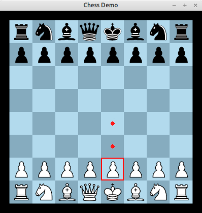

# Chess demo

This folder contains an interactive chess game written in a mix of
Babylon and C.

The "game" is just a simple 2 player chess game. There is no computer
opponent, but you can make moves on the chess board. Only legal chess
moves will be permitted. The game implements nearly all the rules of
chess -- the only caveat is that when a pawn is promoted, you must
promote to a Queen (this is mostly because I couldn't be bothered to
make the UI for selecting which piece to promote to!).

# Screenshot

# How to build this

The easiest way to build the chess demo is to run "make chess" from
the root of the repository. This will build the Babylon compiler (if
needed) and then build the chess demo itself. Then change directory
into packages/chess and type `./build/bin/chess` to run the demo.

Note that you will need SDL2 installed for the build to succeed (e.g.
on Debian-like systems, make sure the "libsdl2-dev" package is
installed).

If you want to verify the code, try running "make verify-chess" from
the root of the repository. (You will need the relevant SMT solver
executables installed.)

# Credits

The example uses some freely available images of chess pieces designed
by Colin M.L. Burnett (see "images" directory). See the README file in
that directory for more info.

I also make use of the "stb_image.h" C library (included in the "src"
folder) to load the images into the program. Licence conditions are
included in the file itself.

Finally, as already mentioned, we use the SDL 2 library to handle
graphics and mouse input. SDL 2 is available separately under a "zlib"
licence.
